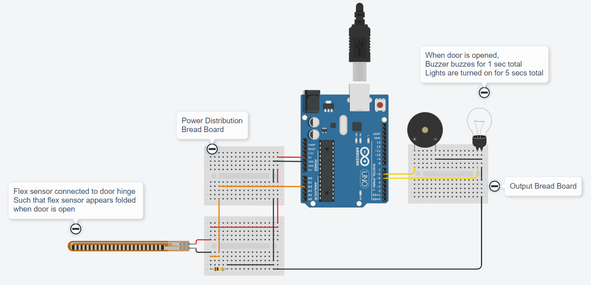

# Assignment 01

## M1 Lead - Ulagaraja J

## Home Automation in TinkerCAD

### [Click this link to view project in TinkerCAD]()

### Components Used :
1. 

### Features :
1. 

### Program Code :
```cpp

```

### Circuit :


### Raw Image :


### Thank You