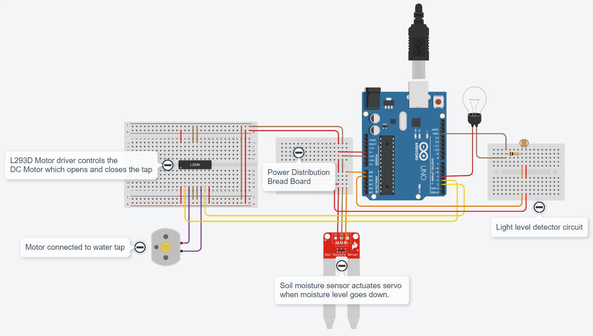
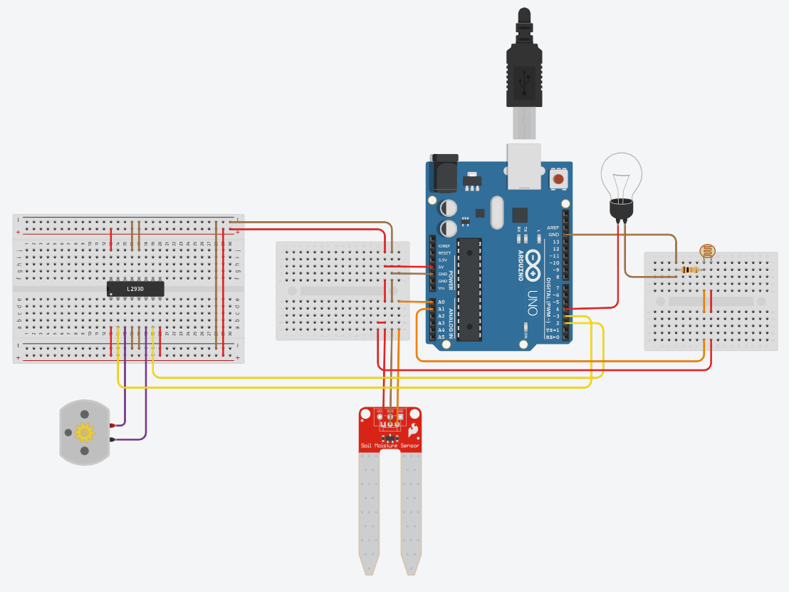

# Assignment 01

## Home Automation in TinkerCAD

### [Click this link to view project in TinkerCAD](https://www.tinkercad.com/things/7znFkm7BxNY?sharecode=3Sj0NNPE3eGHWVqjqUU8dT2SPjxrkFNjiLX1PKpSKOc)

### Components Used :
1. Arduino UNO
1. L293D Motor Driver
1. DC Motor
1. Soil Moisture Sensor
1. Light Dependent Resistor
1. Carbon Resistor
1. Light bulb

### Features :
1. Waters plants automatically based on soil moisture level.
1. Toggles home lights based on sunlight intensity.

### Circuit :

### Raw Image :

### Thank You