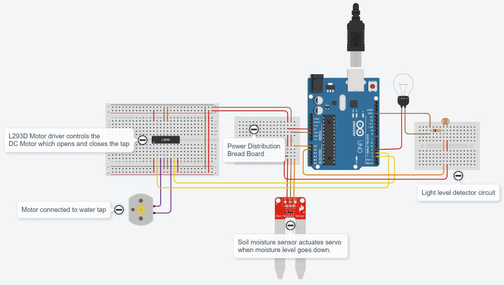
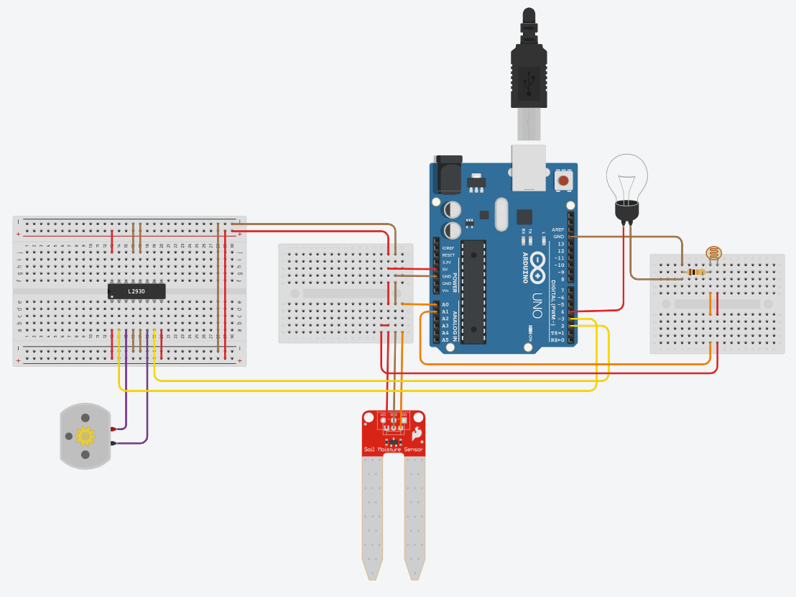

# Assignment 01

## Team Lead - Sayad Pervez B

## Home Automation in TinkerCAD

### [Click this link to view project in TinkerCAD](https://www.tinkercad.com/things/7znFkm7BxNY?sharecode=3Sj0NNPE3eGHWVqjqUU8dT2SPjxrkFNjiLX1PKpSKOc)

### Components Used :
1. Arduino UNO
1. L293D Motor Driver
1. DC Motor
1. Soil Moisture Sensor
1. Light Dependent Resistor
1. Carbon Resistor
1. Light bulb

### Features :
1. Waters plants automatically based on soil moisture level.
1. Toggles home lights based on sunlight intensity.

### Program Code :
```cpp
// C++ code
//

int moistureSensor = A0;
int lightLevelDetector = A1;
int tapForward = 2;
int tapReverse = 3;
int lights = 4;

void setup()
{
  Serial.begin(9600);
  pinMode(moistureSensor, INPUT);
  pinMode(lightLevelDetector, INPUT);
  pinMode(tapForward, OUTPUT);
  pinMode(tapReverse, OUTPUT);
  pinMode(lights, OUTPUT);
  delay(5000);
}

void loop()
{
  toggleLight();
  waterPlant();
}

void toggleLight()
{
  if(analogRead(lightLevelDetector)>940)
    digitalWrite(lights,LOW);
  else
    digitalWrite(lights,HIGH);
}

void waterPlant()
{
  if(analogRead(moistureSensor)<=400)
  {
    // low soil mositure
    pourWater();
    delay(1000);
  }
}

void pourWater()
{
  Serial.println("Starting to pour water\nOpening tap ...");
  // opening tap
  digitalWrite(tapForward,HIGH);
  digitalWrite(tapReverse,LOW);
  delay(5*1000);
  // closing tap
  Serial.println("Closing tap ...");
  digitalWrite(tapForward,LOW);
  digitalWrite(tapReverse,HIGH);
  delay(8*1000); // extra time for completely closing the tap
  // turning off motor
  Serial.println("Turning motors off ...");
  digitalWrite(tapReverse,LOW);
  // providing delay for moisture sensor to read the updated value
  delay(10*1000);
  Serial.println("Pouring water completed");
}
```

### Circuit :


### Raw Image :


### Thank You