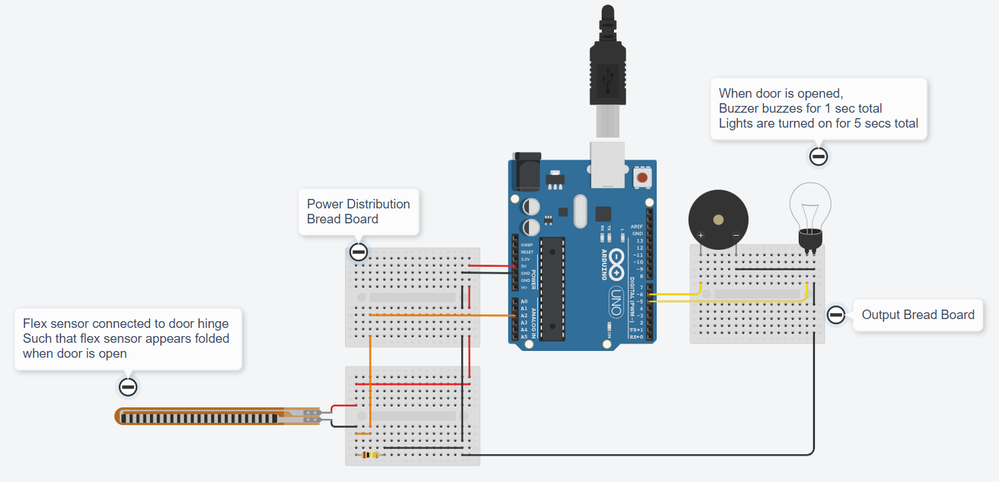
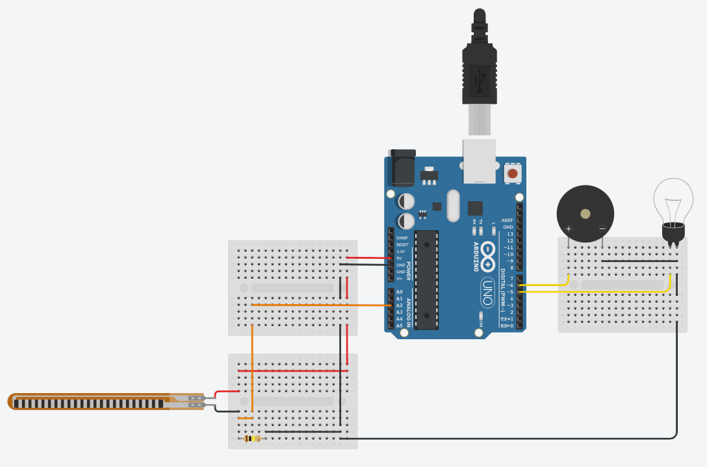

# Assignment 01

## Team Member 1 - Ulagaraja J

## Home Automation in TinkerCAD

### [Click this link to view project in TinkerCAD](https://www.tinkercad.com/things/gVIjPYiatM0?sharecode=lhqW67IfBAwvrpFjalp_ieb9ndPZkuVf5mbt7hcpEzM)

### Components Used :
1. Flex Sensor
1. Arduino UNO
1. Buzzer
1. Bulb
1. Breadboard

### Features :
1. Buzzes buzzer when door gets opened.
1. Lights are turned on for 5 secs once door is opened

### Program Code :
```cpp
// C++ code
//

int flexSensor = A2;
int buzzer = 6;
int lights = 5;

void setup()
{
  Serial.begin(9600);
  pinMode(flexSensor, INPUT);
  pinMode(buzzer, OUTPUT);
  pinMode(lights, OUTPUT);
}

void loop()
{
  bool door = checkDoor(); // true if door is open
  doorAction(door);
}

bool checkDoor()
{
  if(map(analogRead(flexSensor),100,1000,0,1000)>500)
  {
    // door closed
    return(false);
  }
  else
  {
    return(true);
  }
}

void doorAction(bool door)
{
  if(door)
  {
    // if door is opened, buzzer rings for 1 sec and lights are turned on for a total of 5 secs
    digitalWrite(buzzer,HIGH);
    digitalWrite(lights,HIGH);
    delay(1000);
    digitalWrite(buzzer,LOW);
    delay(4000);
    digitalWrite(lights,LOW);
  }
}
```

### Circuit :


### Raw Image :


### Thank You
