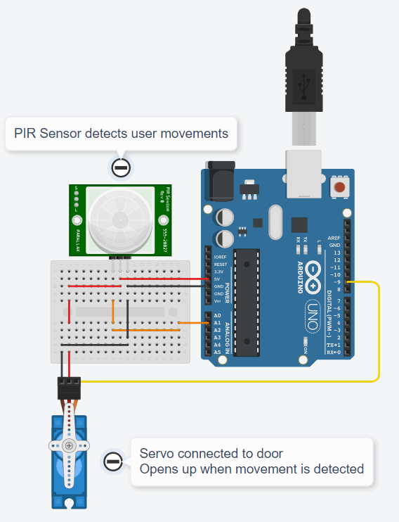
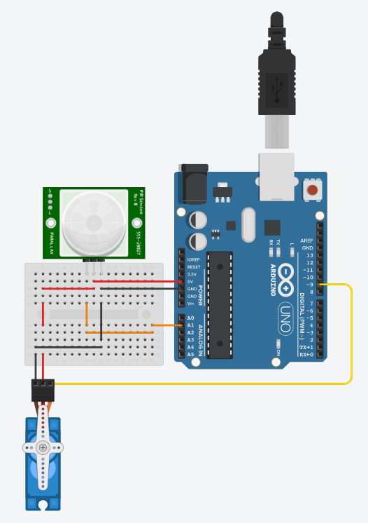

# Assignment 01

## Team Member 2 - Yuvashree R

## Home Automation in TinkerCAD

### [Click this link to view project in TinkerCAD](https://www.tinkercad.com/things/1QGqoxVwXM4)

### Components Used :
1. Arduino UNO
2. PIR Sensor
3. Servo

### Features :
1. Opens and closes doors when movement is detected

### Program Code :
```cpp
// C++ code
//
#include <Servo.h>

int pir = A1;
int servoPin = 9;

Servo myservo;

void setup()
{
  Serial.begin(9600);
  myservo.attach(servoPin);
  myservo.write(0);
  pinMode(pir, INPUT);
}

void loop()
{
  if(motionDetected())
  {
    myservo.write(90);
    delay(5000);
    myservo.write(0);
  }
  delay(1000);
}

bool motionDetected()
{
  Serial.println(analogRead(pir));
  if(analogRead(pir)>100)
    return(true);
  else
    return(false);
}
```

### Circuit :


### Raw Image :


### Thank You
