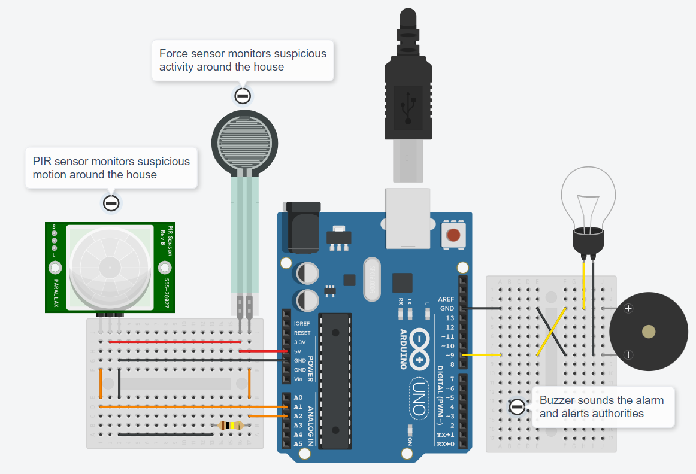
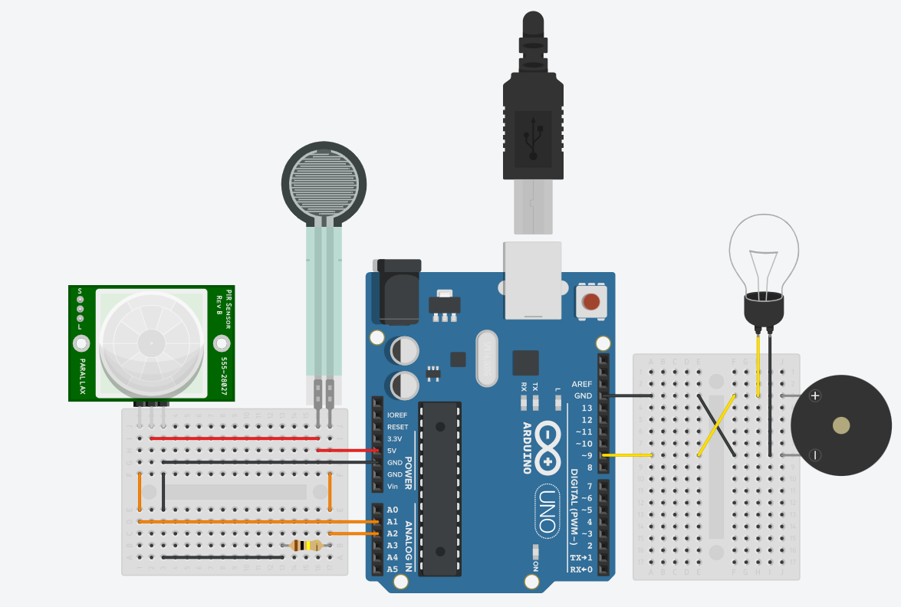

# Assignment 01

## Team Member 3 - Yuvasri M

## Home Automation in TinkerCAD

### [Click this link to view project in TinkerCAD](https://www.tinkercad.com/things/kMHD5xsdo2D?sharecode=FSSbd0AGaNrr0V7-I4v2kaSMZZoT_neUA7-5WsS2yuM)

### Components Used :
1. Arduino UNO
2. PIR Sensor
3. Force Sensor
4. Buzzer
5. Light Bulb

### Features :
- Burglar movement detection via 
    - motion sensing
    - force detection
- Alerting house owners

### Program Code :
```cpp
// C++ code
//

int pir = A1;
int forceSensor = A2;
int buzzer = 9;

void setup()
{
  Serial.begin(9600);
  pinMode(pir, INPUT);
  pinMode(forceSensor, INPUT);
  pinMode(buzzer, OUTPUT);
}

void loop()
{
  if(isPressed() || isMoving())
  {
    digitalWrite(buzzer, HIGH);
    delay(5000);
  }
  digitalWrite(buzzer,LOW);
  delay(500);
}

bool isPressed()
{
  Serial.println("Pressing");
  if(analogRead(A2)>100)
  	return(true);
  else
    return(false);
}

bool isMoving()
{
  Serial.println("Moving");
  if(analogRead(A1)>100)
  	return(true);
  else
    return(false);
}
```

### Circuit :


### Raw Image :


### Thank You
